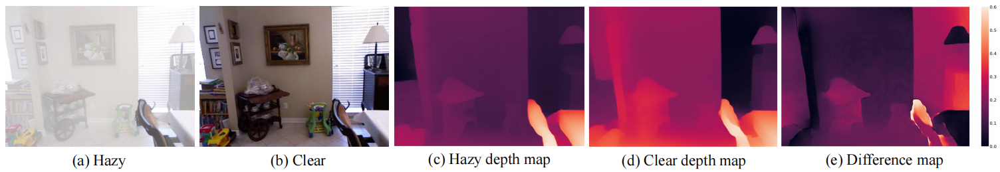
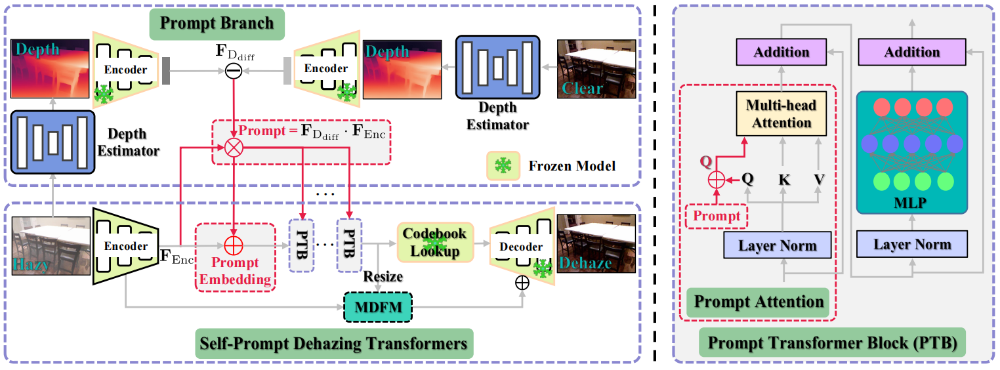
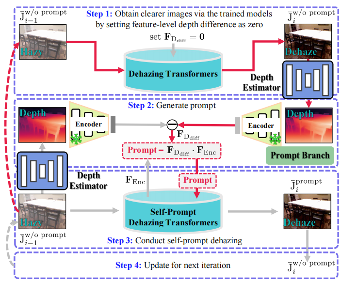
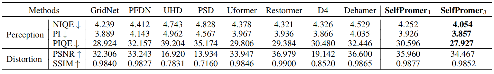
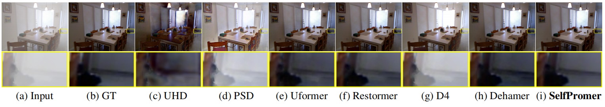
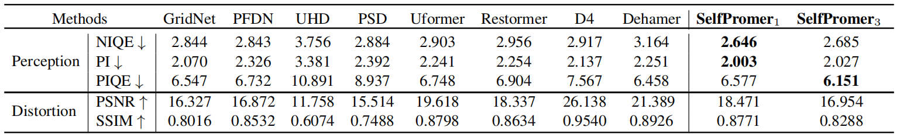
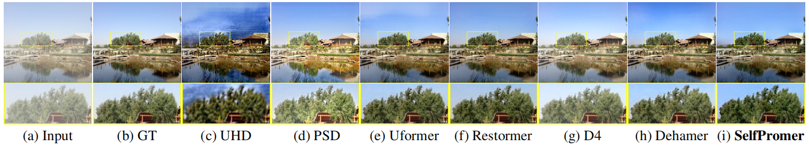
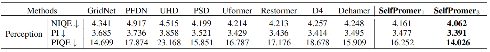
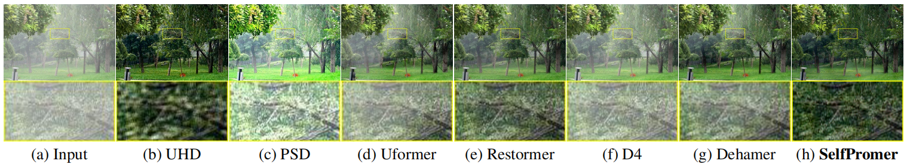

# SelfPromer [AAAI-24]

This is the official PyTorch codes for the paper  
[Selfpromer: Self-prompt dehazing transformers with depth-consistency](https://ojs.aaai.org/index.php/AAAI/article/view/28340)  
[Cong Wang](https://scholar.google.com/citations?user=0DrHHRwAAAAJ&hl=zh-CN), [Jinshan Pan](https://jspan.github.io/), [Wanyu Lin](https://scholar.google.com/citations?hl=zh-CN&user=vgLANV0AAAAJ), [Jiangxin Dong](https://scholar.google.com/citations?hl=zh-CN&user=ruebFVEAAAAJ), Wei Wang, [Xiao-Ming Wu](https://www4.comp.polyu.edu.hk/~csxmwu/)

## Abstract
This work presents an effective depth-consistency Self-Prompt Transformer, terms as SelfPromer, for image dehazing. It is motivated by an observation that the estimated depths of an image with haze residuals and its clear counterpart vary. 
Enforcing the depth consistency of dehazed images with clear ones, therefore, is essential for dehazing. For this purpose, we develop a prompt based on the features of depth differences between the hazy input images and corresponding clear counterparts that can guide dehazing models for better restoration. Specifically, we first apply deep features extracted from the input images to the depth difference features for generating the prompt that contains the haze residual information in the input. 
Then we propose a prompt embedding module that is designed to perceive the haze residuals, by linearly adding the prompt to the deep features. Further, we develop an effective prompt attention module to pay more attention to haze residuals for better removal. By incorporating the prompt, prompt embedding, and prompt attention into an encoder-decoder network based on VQGAN, we can achieve better perception quality. 
As the depths of clear images are not available at inference, and the dehazed images with one-time feed-forward execution may still contain a portion of haze residuals, we propose a new continuous self-prompt inference that can iteratively correct the dehazing model towards better haze-free image generation. 
Extensive experiments show that our SelfPromer performs favorably against the state-of-the-art approaches on both synthetic and real-world datasets in terms of perception metrics including NIQE, PI, and PIQE.


## Motivation


Haze residuals pose a signifcant challenge to accurately estimating the depth of clear images, creating inconsistencies
compared to hazy images. A difference map (e) is utilized to locate haze residuals on the estimated depth, while minimal haze
residuals will result in consistent estimates. By analyzing the difference map, we can identify the impact of haze residuals,
leading to the development of improved dehazing models to mitigate this effect and enhance the quality of dehazed images.
The difference map (e) is derived by |hazy depth − clear depth| with equalization for better visualization.

## Overall of SelfPromer at Training Stage


SelfPromer at training stage. Our method comprises two branches: prompt branch and self-prompt dehazing Transformer branch. 
The prompt branch generates a prompt by using the deep depth difference and deep feature extracted from the hazy input. 
The other branch exploits the generated prompt to guide the deep model for image dehazing. 
We incorporate a prompt embedding module and prompt attention module to perceive and pay more attention to the haze residuals for better removal. 
The proposed modules are formulated into an encoder-decoder architecture based on VQGAN for better perception quality.


## Overall of SelfPromer at Inference Stage


Continuous Self-Prompt Inference. i-th prompt inference contains four steps: Sequential execution from top to bottom. 
The magenta line describes the ‘self’ process that builds the prompt from the hazy image itself.

## Main Results

### Dehazing results on SOTS-Indoor



### Dehazing results on SOTS-Outdoor



### Dehazing results on real images



## Dependencies and Installation

- Ubuntu >= 18.04
- CUDA >= 11.0
- Other required packages in `requirements.txt`
```
# git clone this repository
git clone https://github.com/supersupercong/selfpromer.git
cd UHDformer 

# create new anaconda env
conda create -n selfpromer python=3.8
source activate selfpromer 

# install python dependencies
pip3 install -r requirements.txt
python setup.py develop
```

### Train

```
bash train.sh
```

### Test

```
bash test.sh
```


## Citation
```
@inproceedings{wang2024selfpromer,
  title={Selfpromer: Self-prompt dehazing transformers with depth-consistency},
  author={Wang, Cong and Pan, Jinshan and Lin, Wanyu and Dong, Jiangxin and Wang, Wei and Wu, Xiao-Ming},
  booktitle={Proceedings of the AAAI Conference on Artificial Intelligence},
  volume={38},
  number={6},
  pages={5327--5335},
  year={2024}
}
```

## License

<a rel="license" href="http://creativecommons.org/licenses/by-nc-sa/4.0/"></a><br />This work is licensed under a <a rel="license" href="http://creativecommons.org/licenses/by-nc-sa/4.0/">Creative Commons Attribution-NonCommercial-ShareAlike 4.0 International License</a>.

## Contact

Contact: Cong Wang [supercong94@gmail.com]

## Acknowledgement

This project is based on [FeMaSR](https://github.com/chaofengc/FeMaSR).
